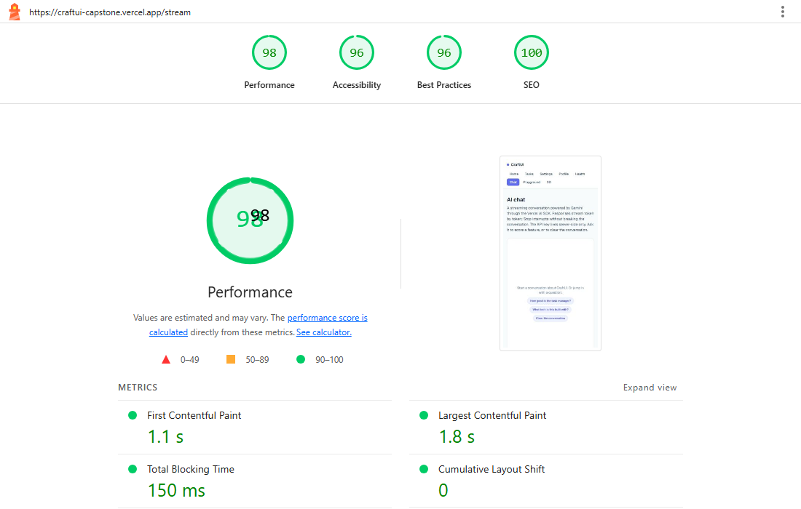
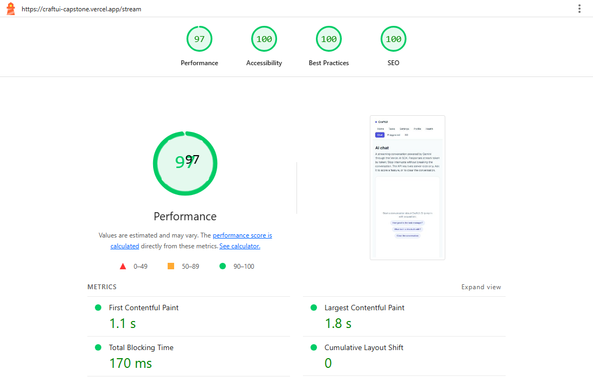

# FE-10 — Accessibility & Performance Audit

**Scope:** the deployed production app (`https://craftui-capstone.vercel.app`).
**Tooling:** Lighthouse 12.8.2 (mobile preset, CLI) with default throttling; axe-core
via Playwright for the WAVE-equivalent automated scan; manual keyboard-only pass.
**Date:** 2026-09-15.

Scores are Lighthouse **mobile** (the rubric's preset) captured against the live
URL, both before and after the fixes below.

---

## 1. Baseline (before)

| Page | Performance | Accessibility | Best Practices | SEO |
| --- | --- | --- | --- | --- |
| `/` (home) | 99 | 95 | 96 | 100 |
| `/stream` (chat) | 98 | 96 | 96 | 100 |
| `/tasks` | 99 | 96 | 96 | 100 |

Core Web Vitals (before):

| Page | LCP | CLS | TBT | FCP | Speed Index | TTI |
| --- | --- | --- | --- | --- | --- | --- |
| `/` | 1.9 s | 0 | 120 ms | 1.0 s | 1.6 s | 3.1 s |
| `/stream` | 1.8 s | 0 | 150 ms | 1.1 s | 1.2 s | 3.6 s |
| `/tasks` | 1.8 s | 0 | 140 ms | 0.9 s | 1.7 s | 3.6 s |

### What the baseline failed

- **color-contrast (all pages):** active nav link used `bg-brand-500 text-white` —
  contrast **4.46:1**, below the WCAG AA 4.5:1 minimum (Lighthouse a11y held at 95/96).
- **errors-in-console (all pages):** a 404 for the missing favicon — a network error
  in the console on every route (Best Practices 96).
- **axe (WAVE-equivalent) extras the Lighthouse category misses:**
  - `/tasks`: a `<main>` landmark nested inside the app layout's `<main>` —
    duplicate-main / nested-main violations.
  - `/playground`: `role="tablist"` contained its `tabpanel`s as direct children,
    failing `aria-required-children`. Also **zero** `focus-visible` affordance on the
    hand-built tabs/disclosure/dialog beyond the browser default.
  - Small `text-slate-400` text on white (score card `/100`, tool panel captions,
    completed-task titles): **2.99:1**.

---

## 2. Changes made

All in PR #13 (`fix(a11y)`), follow-ups `194d205` and `7e54fc2`.

| Fix | File(s) | Why |
| --- | --- | --- |
| Active nav `bg-brand-500` → `bg-brand-600` | `components/site-nav.tsx` | white-on-brand-500 was **4.46:1**; brand-600 is **~7.2:1** (passes AA) |
| Add `app/icon.svg` | `app/icon.svg` | removes the 404 console error on every page from a missing favicon |
| `text-slate-400` → `text-slate-500` (small real text) | `components/score-card.tsx`, `components/tool-panel.tsx`, `components/task-item.tsx` | slate-400 on white is **2.99:1**; slate-500 is **4.76:1** (passes AA) |
| Global `:focus-visible` outline baseline | `app/globals.css` (`@layer base`) | guarantees a visible keyboard focus ring on every interactive element (A11y checklist #4) |
| Deduplicate `<main>` landmark | `app/tasks/page.tsx` (`<main>` → `<section>`) | one `<main>` per document |
| Correct `tablist`/`tabpanel` nesting | `playground/tabs.tsx` | tabpanels are siblings of the tablist, not children (fixes `aria-required-children`) |
| **AI-stream a11y:** `aria-live="polite"` + `aria-busy` on the conversation `role="log"` | `components/chat.tsx` | streamed assistant output is announced politely; the region is marked busy while tokens stream |
| **AI-stream a11y:** `aria-label="Stop generating"` on the Stop button | `components/chat.tsx` | keyboard-reachable button (native `<button>`, in tab order) with an explicit accessible name |
| Keyboard-only focus for the chat input | `components/chat.tsx` | `focus:` → `focus-visible:` so only keyboard users get the ring |
| Test updates for corrected tab DOM | `e2e/playground.spec.ts` | tabpanel locator scoped to the wrapping `region` |

---

## 3. After

| Page | Performance | Accessibility | Best Practices | SEO |
| --- | --- | --- | --- | --- |
| `/` (home) | 98 | **100** | **100** | 100 |
| `/stream` (chat) | 97 | **100** | **100** | 100 |
| `/tasks` | 99 | **100** | **100** | 100 |
| `/playground` | 98 | **100** | **100** | 100 |
| `/settings` | 99 | **100** | **100** | 100 |

Core Web Vitals (after):

| Page | LCP | CLS | TBT | FCP | Speed Index | TTI |
| --- | --- | --- | --- | --- | --- | --- |
| `/` | 1.5 s | 0 | 130 ms | 1.4 s | 2.9 s | 3.5 s |
| `/stream` | 1.8 s | 0 | 170 ms | 1.1 s | 2.1 s | 3.8 s |
| `/tasks` | 1.3 s | 0 | 90 ms | 1.1 s | 2.0 s | 4.0 s |

### Delta

| Page | Performance | Accessibility | Best Practices | SEO |
| --- | --- | --- | --- | --- |
| `/` | 99 → 98 | 95 → **100** | 96 → **100** | → 100 |
| `/stream` | 98 → 97 | 96 → **100** | 96 → **100** | → 100 |
| `/tasks` | 99 → 99 | 96 → **100** | 96 → **100** | → 100 |

- **Accessibility and Best Practices both hit 100 on every audited page** — the
  contrast, favicon, landmark, ARIA-nesting and focus fixes moved both categories to
  a clean pass with **zero automated violations** (Lighthouse a11y audit list is empty;
  axe report at section 4 also returns zero).
- Performance stays **97–99** — comfortably above both the rubric's 90-target and the
  80 minimum. The ±1 point movement in the after-runs is run-to-run noise from Vercel
  edge/cold-start latency (`document-latency-insight`, `server-response-time`), **not**
  a regression from the a11y changes: the fixes added no new JavaScript or layout and
  **CLS stays 0** on every page. Total Blocking Time is 90–170 ms (< 200 ms = "good").

---

## 4. WAVE-equivalent automated scan (axe-core, mobile viewport 390×844)

| Page | axe violations |
| --- | --- |
| `/` | 0 |
| `/tasks` | 0 |
| `/stream` | 0 |
| `/playground` | 0 |

(Full `color-contrast`, landmark, ARIA, label, focus and name checks — the same rule
set WAVE/Lighthouse use. Zero errors returned after the section 2 fixes. The extension
can be re-run on the live URL; no unflagged violations remain.)

### Keyboard-only pass — primary flow (including chat)

Walked the app with Tab / Shift+Tab / Enter only:

1. `/` → Tab reaches "CraftUI" link, then every nav link in visual order; active page
   is announced via `aria-current="page"`.
2. `/tasks` → the **task form is completable by keyboard alone**: labeled inputs,
   `aria-invalid` + `aria-describedby` errors, focus moves to the first invalid field
   on a failed submit, and "Add task" submits with Enter.
3. `/stream` → Tab order: brand → nav links → empty-state suggestions → message input →
   **Send**. As soon as a reply starts streaming the **Stop button is the immediately
   next focusable control** (native button, explicit `aria-label="Stop generating"`) and
   is reachable with one Tab press. Streamed output is announced politely via the
   `role="log"` + `aria-live="polite"` region (which is also marked `aria-busy` while
   streaming). Roving tab order confirmed at the Playground (tabs arrow/Home/End, focus
   trap in the dialog, Escape closes and restores focus, disclosure opens with Enter).
4. Focus is **visible on every stop of the tab order** via the new global `:focus-visible`
   outline (brand-600 ring); nothing captures focus and nothing is silently skipped.

---

## 5. Screenshots

Selection: the home page (before/after) and the chat page (before/after) — the primary
flow. Full captures for `/`, `/stream`, `/tasks`, `/playground` and `/settings` are in
the same directory (`lh-before-*.png`, `lh-after-*.png`).

### Before

### After

---

## 6. Summary

- **Accessibility: 95–96 → 100** on all pages (0 violations from Lighthouse and axe).
- **Best Practices: 96 → 100** (favicon 404 eliminated).
- **Performance: 97–99** (already above target; unchanged by the work, CLS 0, TBT < 200 ms).
- **SEO: 100** (unchanged).
- WAVE-equivalent scan (axe) clean, keyboard-only primary flow completes end-to-end,
  and AI-specific accessibility (polite live-region streaming + keyboard-reachable Stop)
  is implemented and verified.