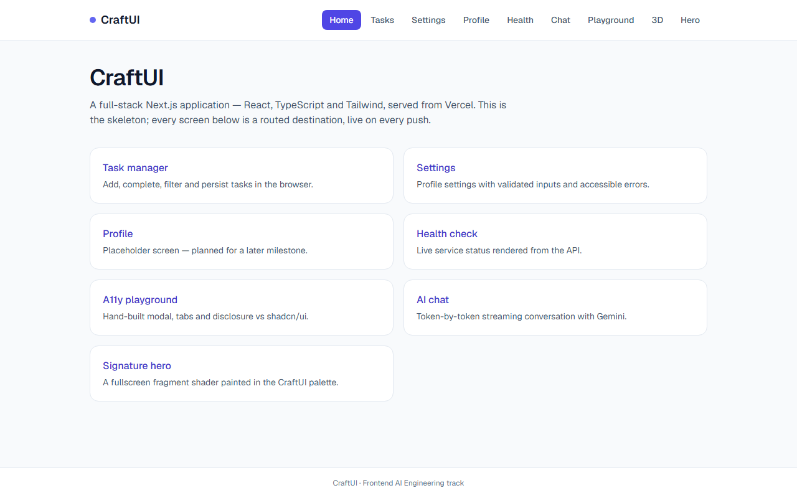
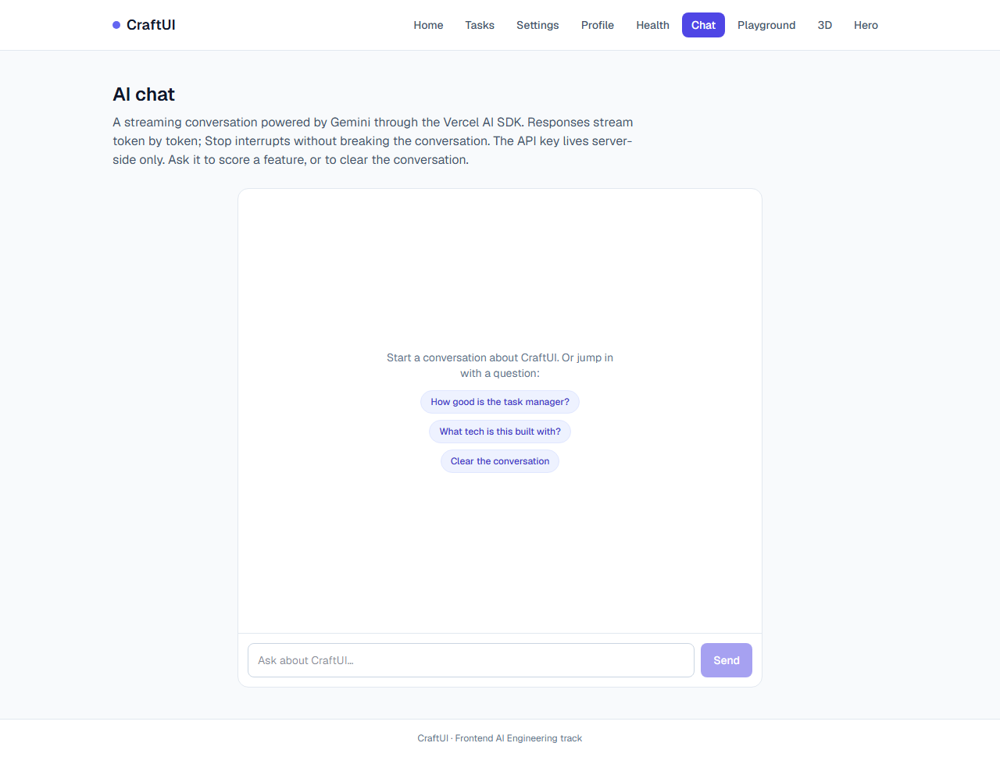
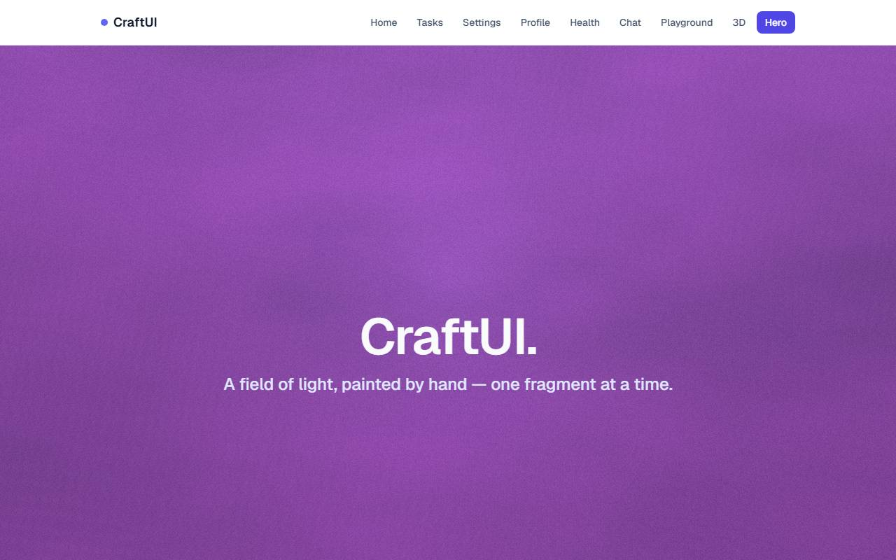
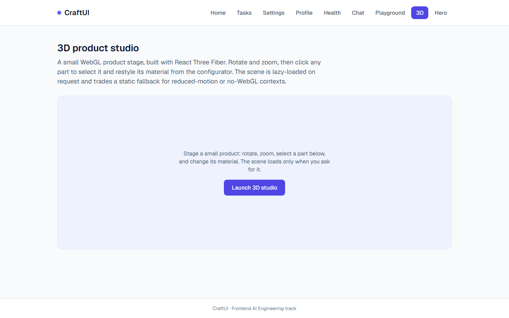
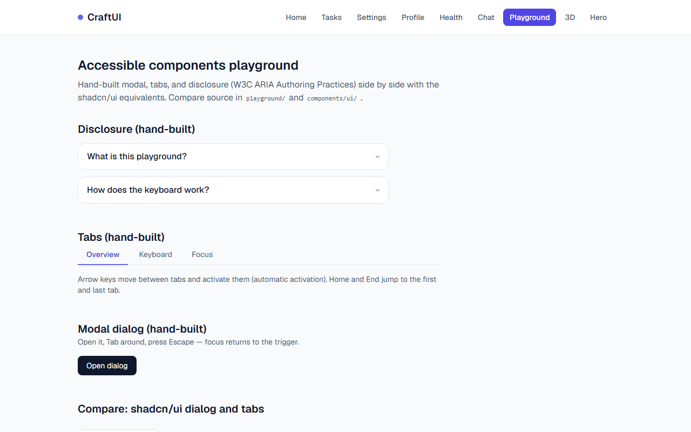
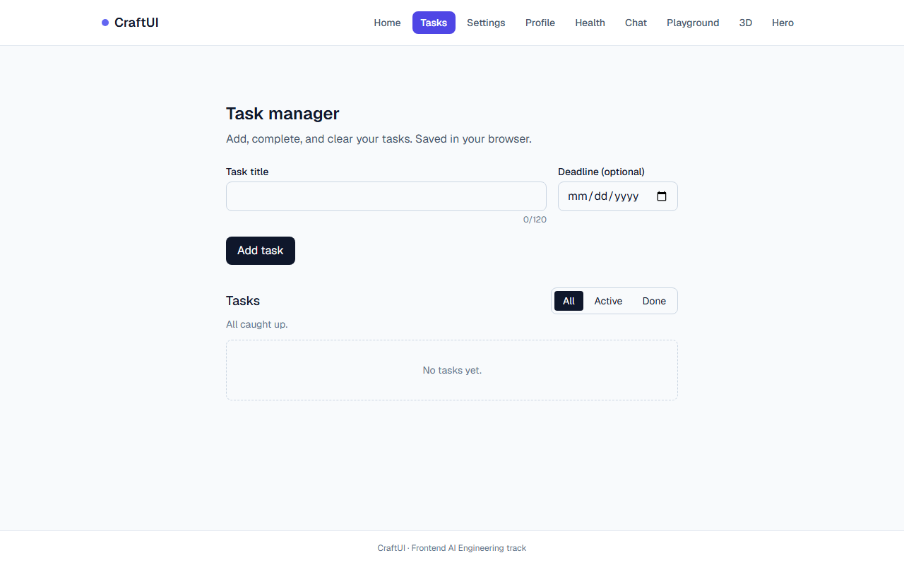

# CraftUI

A full-stack web application that ships a real UI product rather than a
toy: AI chat with streaming and tools, accessible component fundamentals,
3D, custom shaders, and hardened production APIs — built entirely on
Vercel. It is the capstone project for the **Frontend AI Engineering
track** at FlyRank, and every feature was planned, built, tested, and
shipped through human-AI collaboration.

**Production:** https://craftui-capstone.vercel.app

**Capstone portfolio entry** (brief, AI integration, audit, deployment checklist,
reflection): [docs/CAPSTONE.md](docs/CAPSTONE.md).

| Home | Streaming AI chat |
| --- | --- |
|  |  |

| Signature shader hero | 3D product studio |
| --- | --- |
|  |  |

| Playground | Task manager |
| --- | --- |
|  |  |

## Stack

- **Framework:** Next.js 15 (App Router)
- **Language:** TypeScript (strict, no `any`)
- **UI:** React with Tailwind CSS v4 (token-driven styling)
- **Backend:** Next.js Route Handlers in `app/api/*` — deployed as Vercel
  serverless functions from the same project as the frontend
- **AI:** Google Gemini via the Vercel AI SDK (`ai`, `@ai-sdk/google`)
- **3D/shaders:** React Three Fiber, Three.js, raw GLSL fragment shaders
- **Testing:** Vitest + React Testing Library (unit), Playwright (E2E)
- **Hosting:** Vercel — one project serves the frontend and the API

## Running locally

```bash
npm install
npm run dev
```

Open http://localhost:3000. No build step or separate server is needed —
the API routes run in-process during development and become serverless
functions in production.

Optional: create a `.env` file from `.env.example` and add a Gemini API
key to turn on the chat screen, otherwise `/stream` renders its empty
state with a notice. The key never leaves the server.

## Scripts

| Command | Purpose |
| --- | --- |
| `npm run dev` | Start the dev server on http://localhost:3000 |
| `npm run build` | Production build (`next build`) |
| `npm run lint` | ESLint (`next/core-web-vitals`) |
| `npm run test` | Unit tests (Vitest + RTL) |
| `npm run test:coverage` | Unit tests with a coverage report (`coverage/index.html`) |
| `npm run e2e` | Playwright E2E — 4 projects (Chromium, Firefox, WebKit desktop, WebKit mobile) |

## Environment variables

| Variable | Required | Description |
| --- | --- | --- |
| `GOOGLE_GENERATIVE_AI_API_KEY` | for `/stream` | Gemini API key, read server-side only. Get a free key at https://aistudio.google.com/apikey |
| `NEXT_PUBLIC_APP_URL` | optional | Public origin; used by `/health` to reach the API. Falls back to request headers locally |
| `GEMINI_MODEL` | optional | Override the model (default `gemini-3.6-flash`) |

Same values are configured in Vercel's Production/Preview env vars. See
[.env.example](.env.example).

## Screens

| Route | Screen | Notes |
| --- | --- | --- |
| `/` | Home | Landing with links to every screen |
| `/tasks` | Task manager | Add/toggle/delete tasks, filters, localStorage persistence |
| `/settings` | Settings | Profile form, `react-hook-form` + zod with `noValidate` |
| `/profile` | Profile | Placeholder |
| `/health` | Health check | Fetches live data from `/api/health` |
| `/playground` | Playground | Hand-built modal/tabs/disclosure beside shadcn/ui equivalents; keyboard-only E2E |
| `/stream` | AI chat | Token-by-token streaming chat with Gemini, two tools rendered as real components, designed error + retry states |
| `/microinteractions` | Buttons with a Brain | `StatefulButton` lifecycle (FE-AA1) with forced-success/error triggers |
| `/3d` | 3D product studio | React Three Fiber stage (FE-AA2): orbit/zoom, select parts, material configurator; lazy-loaded with reduced-motion fallback |
| `/hero` | Signature hero | Fullscreen aurora fragment shader (FE-AA3) with headline overlay; DPR-capped, pauses when hidden, static-gradient fallback |

## Tool contract (`/stream`)

The chat model exposes two tools (Zod schemas in `lib/ai/tool-schemas.ts`,
definitions in `lib/ai/tools.ts`). Schemas are shared between the server
route and the client tool-result components, so a rendered shape is always
validated against the server's declared contract.

| Tool | Purpose | Output rendered as |
| --- | --- | --- |
| `scoreFeature` | Evaluates a real CraftUI feature | **ScoreCard** (`{ feature, score, verdict, summary, strengths[], gaps[] }`) |
| `clearConversation` | Asks for confirmation before clearing history | **confirm/cancel card**; clearing is client-side only |

Tool parts render a distinct card per AI SDK state: *input-streaming*,
*input-available*, *output-available*, and *output-error*.

## Architecture

```
app/           App Router pages and routes
app/api/       Route Handlers → Vercel serverless functions
  health/      Health check (deployment/liveness)
  chat/        Streaming Gemini chat — rate-limited, input-capped, tools
components/    React components (Server by default, "use client" only for interactivity)
playground/    Hand-built ARIA component implementations and notes
components/ui  shadcn/ui registry components (Radix-powered dialog/tabs)
lib/ai         LLM config, tool definitions and shared schemas
lib/security   Rate limiter + input caps guarding the chat route
lib/util       Cross-cutting helpers (device detection, etc.)
types/         Shared TypeScript contracts between UI and API
e2e/           Playwright specs (responsive + keyboard-only accessibility)
docs/          Screenshots used by this README
```

Two decisions that shape the layout:

- **Server Components by default (FE-04).** A component opts into
  `"use client"` only for real interactivity — forms, navigation state,
  chat streaming. The route map in this README and `app/api/health` are the
  reference implementations.
- **Design tokens, not hex values.** Colors are Tailwind v4 CSS-first
  tokens in `app/globals.css` (`--color-brand-*`, `--color-ink`,
  `--color-paper`). Components reference tokens so a theme change is one
  file.

### Security of `/api/chat`

The Gemini route is the only one that spends money per request, so it gets
two layers of protection:

1. **Rate limit — 20 requests/IP/60s.** An in-memory fixed-window limiter
   keyed by client IP (`lib/security/rate-limit.ts`) returns a designed
   429 with `Retry-After`. Because it runs inside the serverless instance,
   the budget is per-instance rather than global — the documented trade-off
   for staying dependency-free; a production team would layer Vercel's WAF
   rate limiting on top.
2. **Input caps — `lib/security/chat-guard.ts`.** Before the prompt is even
   built the route rejects an empty body (400), more than 60 messages (413),
   a single message over 12,000 characters (413), or a total payload over
   80,000 characters (413). Text is measured from both the legacy `content`
   and the AI SDK `parts` shapes, so even a limiter bypass can burn only a
   bounded number of tokens.

## Testing

Tests are the contract for verified changes. Conventions:

- Components are queried the way a user queries the page (role/label, never
  test IDs).
- The AI route is always mocked at the transport boundary — `@ai-sdk/react`
  in Vitest, `page.route` in Playwright — so the real Gemini API is never
  called during tests.
- `npm run lint`, `npm run build`, `npm run test`, and `npm run e2e` all
  run in CI on push and block merges.

Key suites:

- `components/__tests__/chat.test.tsx` — the highest-risk UI: empty,
  pending, streaming, stop, error and retry.
- `components/__tests__/settings-form.test.tsx`, `task-form.test.tsx` —
  validated forms (zod, `noValidate`, a11y attributes).
- `components/__tests__/signature-hero.test.tsx` — WebGL detection and the
  static fallback.
- `lib/__tests__/chat-guard.test.ts` + `rate-limit.test.ts` — the chat
  route's abuse defence.
- `e2e/chat-error.spec.ts` (mock-served failure → retry) and
  `e2e/chat.spec.ts` (primary flow) cover the chat end-to-end.
- `e2e/skeleton.spec.ts` — every screen loads without horizontal overflow
  at 375px and 1280px, across all four browser projects.

## Known limitations

A consolidated list of limitations and future work lives in the [capstone
submission](docs/CAPSTONE.md#4-known-limitations--future-improvements); the
short version: chat history is browser-local, the rate limiter is per-instance
in-memory (documented trade-off), the 3D studio uses procedural meshes only,
and two WebGL-heavy components rely on Playwright coverage rather than jsdom
units.

## Shipping flow

Branch → PR → CI + Vercel preview → squash-merge → auto-deploy to
production from `main`. Conventional Commits throughout.

## Project status

Shipped, tested, and running in production. See "Feature work" below for
the full arc; every item is deployed and verified end-to-end.

> **Week 6 · FE-06 streaming AI chat** — Gemini conversation via the AI SDK
> (`app/api/chat` + `components/chat.tsx`): token-by-token streaming, Stop
> mid-stream, localStorage persistence, bottom-pinned auto-scroll with a
> jump-to-latest affordance.
>
> **FE-07 tool results & structured output** — `scoreFeature` (typed Zod
> input) renders as a bespoke score card; `clearConversation` is a
> user-interaction tool with a confirmation card; every tool-part state has
> a distinct, designed treatment including a failure card.
>
> **FE-08 error, empty & edge states** — mid-stream failure renders a
> designed error banner with a "Retry last message" (double-click safe) plus
> Dismiss; route-level error boundaries (`app/error.tsx`,
> `app/stream/error.tsx`); a layout-matched thinking skeleton; a first-run
> empty state with click-to-fill suggestions; mobile Safari fixes (`dvh`
> height, `overscroll-contain`).
>
> **FE-AA1 Buttons with a Brain** — `components/stateful-button.tsx`
> choreographs idle → hover/focus → loading → success/error → idle as a
> fixed-width FSM with transform/opacity-only transitions. Spam-click safe,
> keyboard-focusable with a visible ring, `prefers-reduced-motion` drops
> motion but never feedback. Demo page `/microinteractions`.
>
> **FE-AA2 First 3D experience** — `/3d` renders a staged product scene in
> React Three Fiber: orbit/zoom, tap-to-select any of four parts, and a
> configurator (color, metalness, roughness, wireframe) plus auto-rotate.
> The whole Three.js stack is dynamically imported only after clicking
> "Launch 3D studio", DPR is capped, meshes are procedural (no external
> GLB bytes), and it respects `prefers-reduced-motion` with a static
> fallback card.
>
> **FE-AA3 Signature hero** — `/hero` is a fullscreen personalised aurora
> painted by a hand-written fragment shader. All three core uniforms are
> wired: `u_time` drives slow noise, `u_resolution` keeps the field
> aspect-correct, `u_mouse` leans the flow toward the cursor with a soft
> glow beneath the pointer. Brand-remixed palette, film-grain pass, and a
> vignette that keeps overlays readable. DPR capped at 1.75, renders pause
> when the tab is hidden, and reduced-motion/missing-WebGL swap the canvas
> for a static gradient in the same palette.
>
> **FE-05 accessible component fundamentals** — hand-built modal, tabs, and
> disclosure (W3C APG patterns) with keyboard-only Playwright coverage and a
> playground comparing against shadcn/ui's Radix dialog/tabs. Includes a
> Safari fix: WebKit doesn't focus buttons on click, so the dialog trigger
> explicitly focuses itself before opening to guarantee return-of-focus.
>
> **FE-09 verified quality bar** — expanded unit + E2E coverage; the AI
> route mocked at the transport boundary; lint/build/test/e2e gating in CI.
>
> **FE-11 production hardening** — cross-browser E2E now runs Chromium,
> Firefox, WebKit (desktop), and WebKit mobile (Safari); the chat route
> gained the rate limiter and input caps described above; this README.